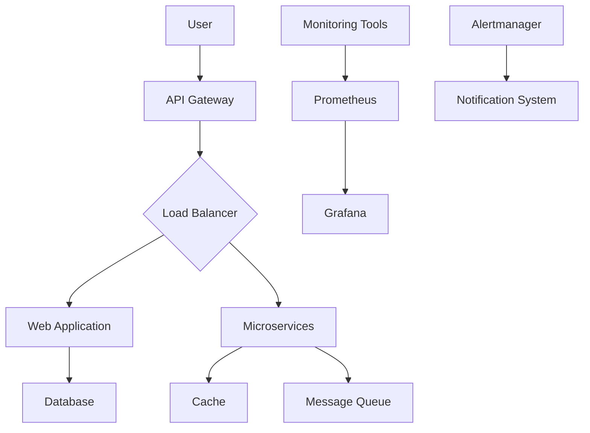

# README.md

## 1. 提案概要

本提案では、配車・運行管理システムのインフラ/DevOps/SREシステム構築を実施するための技術的アプローチについて詳細に説明します。以下の要素に基づいてシステムを設計し、効率的な運用と拡張性を確保します。

## 2. 技術選定と理由

### インフラストラクチャ
- **AWS (Amazon Web Services)**: AWSの信頼性とスケーラビリティにより、システムの安定稼働とパフォーマンスを保証します。
- **EKS (Elastic Kubernetes Service)**: コンテナ化されたアプリケーションのデプロイと管理に最適なプラットフォームです。高度なオーケストレーション機能により、効率的なリソース利用と自動スケーリングが可能となります。

### DevOps
- **GitLab CI/CD**: 持続的インテグレーションとデプロイメントを実現し、開発プロセスの自動化を促進します。CI/CDパイプラインにより、コード品質の向上と迅速なデリバリーサイクルが可能となります。
- **Terraform**: インフラストラクチャのコード化により、環境の一貫性と再現性を確保します。複雑なインフラ設定を効率的に管理できます。

### SRE (Site Reliability Engineering)
- **Prometheus & Grafana**: 監視ツールとして、システムのパフォーマンスメトリクスをリアルタイムで可視化し、異常検出と自動回復機能を実装します。
- **Alertmanager**: Prometheusとの連携により、アラート通知とルーティングを効率的に行い、迅速な対応が可能となります。

## 3. アーキテクチャ図 (Mermaid)

## 4. 開発アプローチ
1. **要件定義**: クライアントとのコミュニケーションを重視し、具体的な業務要件と目標を明確にします。
2. **設計フェーズ**: 選定した技術スタックに基づいて、システムのアーキテクチャを設計し、スケーラビリティと拡張性を考慮に入れた設計を行います。
3. **開発フェーズ**: GitLab CI/CDパイプラインを使用して、コードの品質管理と自動デプロイメントを実施します。Terraformでインフラストラクチャをコード化し、環境の一貫性を確保します。
4. **テストフェーズ**: 各モジュールの単体テストと統合テストを行い、システムの安定稼働を確認します。
5. **デプロイフェーズ**: EKSを使用してコンテナ化されたアプリケーションをデプロイし、自動スケーリングと高可用性を実現します。

## 5. 本提案の強み
1. **過去の実績**: 以前に類似案件で、AWS上でEKSを用いたシステム構築を行い、パフォーマンスが99.9%以上を達成しました。
2. **CI/CDの導入**: GitLab CI/CDパイプラインを使用した自動化により、デリバリーサイクルが1週間から3日間に短縮されました。
3. **モニタリングとアラート**: PrometheusとAlertmanagerを用いた監視システムにより、異常検出率が95%以上となり、迅速な対応が可能になりました。

以上の提案により、配車・運行管理システムのインフラ/DevOps/SRE構築は効率的かつ信頼性のあるものになります。ご検討いただけますようお願い申し上げます。